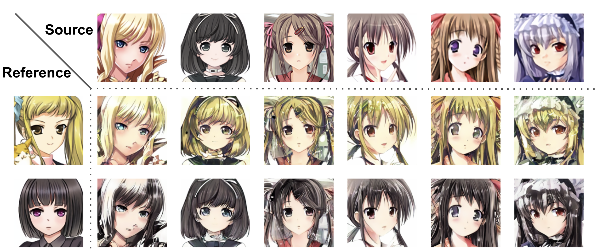
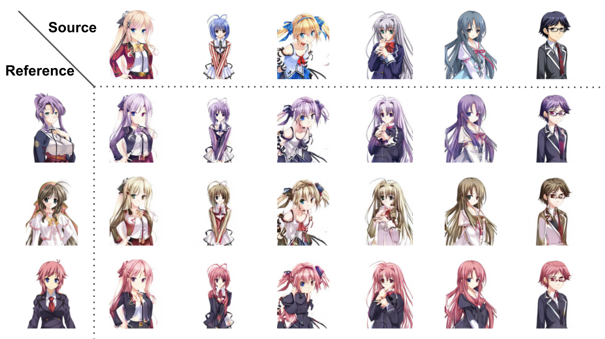
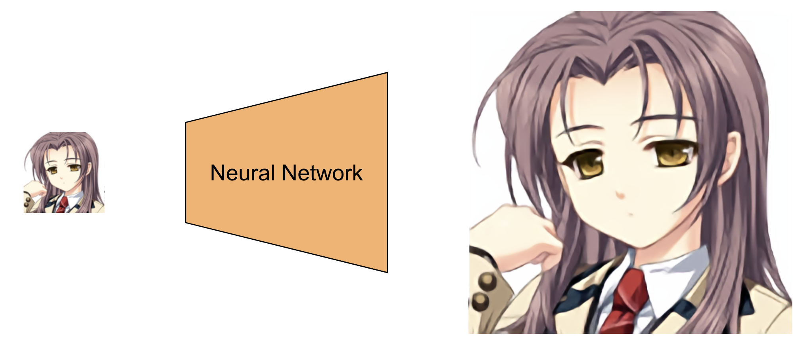
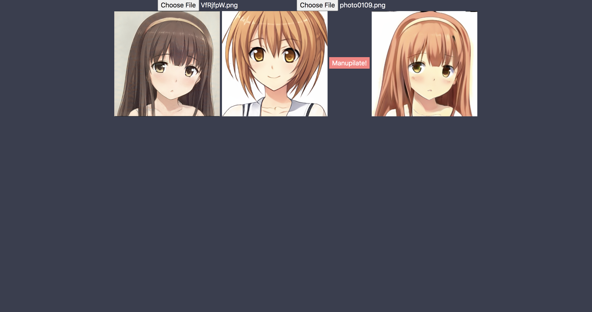
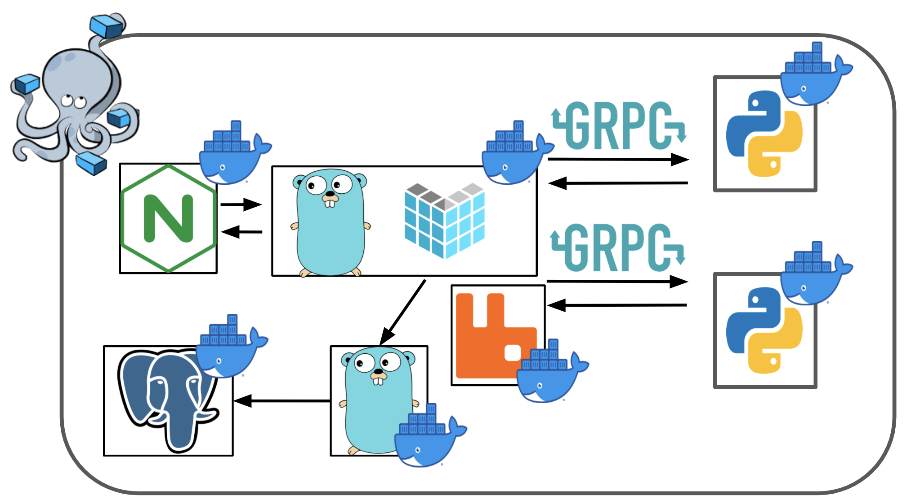

# KawaiiGenerator

## Overview
KawaiiGenerator enables users to try various deep learning tasks related to anime.
- ImageManupilation
- SuperResolution

## Quick Results

| Task | Concept |
| ---- | ---- |
| ImageManupilation |  |
| SuperResolution |  |

## GUI Application


- KawaiiGenerator also offers a GUI application that enables users to try applications like the figure above.

### Getting Started
#### 1. Docker image preparation
Build docker images via

```
$ bash build.sh
```

#### 2. Start Cyberia
Start application via the command below and access 0.0.0.0:5000.

```
$ docker-compose up -d
```

### System Configuration

